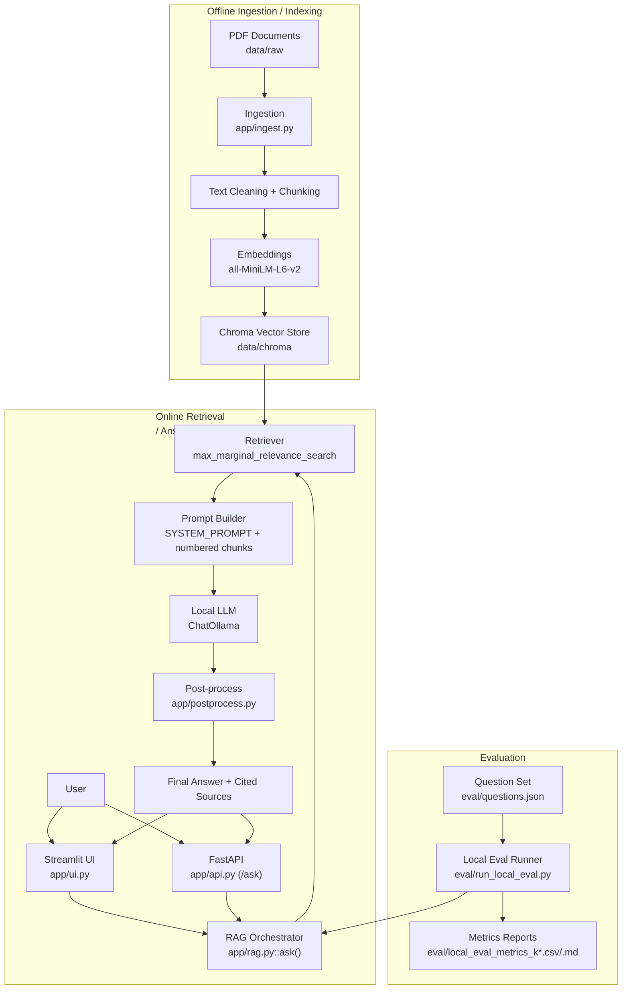

# Security Copilot RAG

[](./README.md)
[](./requirements.txt)
[](./LICENSE)
[](./README.md)

Local-first Retrieval-Augmented Generation (RAG) assistant for cybersecurity policy documents with citation-aware answers.

Supported corpus:
- NIST CSF 2.0 (`NIST.CSWP.29`)
- NIST SP 800-61r3
- OWASP Top 10 for LLM Applications 2025

## TL;DR

- This is **v1** of a local-first security policy RAG copilot.
- It ingests trusted cybersecurity PDFs, retrieves relevant chunks with Chroma/MMR, and generates citation-aware answers with Ollama.
- It includes a deterministic local evaluation pipeline and tests for answer/citation post-processing behavior.
- Current benchmark indicates `k=10` performs better than `k=8` on citation and grounding proxy metrics.
- Next versions will add hosted model support (including OpenAI), larger document coverage, and stronger evaluation rigor.

## Overview

This project is designed as a production-style portfolio project for a first RAG system:
- Offline PDF ingestion and chunked indexing
- Vector search with Max Marginal Relevance (MMR)
- Local LLM generation via Ollama
- Post-processing to enforce answer quality and citation structure
- Dual serving interfaces (Streamlit + FastAPI)
- Deterministic local evaluation pipeline with comparable `k` settings

Version note:
- This repository is the **v1 baseline** focused on local/offline operation and a narrow, high-signal policy corpus.

## Architecture



Detailed architecture notes: `docs/architecture.md`.

## Repository Structure

- `app/ingest.py`: PDF loading, cleaning, metadata normalization, chunking, vector DB build
- `app/rag.py`: retrieval + prompt orchestration + model call
- `app/postprocess.py`: citation parsing, answer filtering, and output normalization
- `app/ui.py`: Streamlit chat interface
- `app/api.py`: FastAPI backend (`/health`, `/ask`)
- `eval/run_local_eval.py`: deterministic local evaluation pipeline
- `eval/questions.json`: evaluation question set
- `scripts/`: convenience launch/testing scripts
- `data/raw/`: source PDFs
- `data/chroma/`: persisted vector index
- `tests/test_rag_normalization.py`: unit tests for post-processing logic

## Tech Stack

- Python, FastAPI, Streamlit
- LangChain, ChromaDB
- Ollama (`llama3.1:8b` default)
- Sentence Transformers (`all-MiniLM-L6-v2`)
- Pandas + local metric scripts for deterministic evaluation

## Quickstart

1. Create and activate environment:

```bash
python3.11 -m venv .venv
source .venv/bin/activate
```

2. Install dependencies:

```bash
pip install -r requirements.txt
```

3. Pull and run local model:

```bash
ollama pull llama3.1:8b
ollama serve
```

4. Build vector store:

```bash
python app/ingest.py
```

5. Launch app:

```bash
./scripts/run_ui.sh
```

## Running the Project

Streamlit UI:

```bash
./scripts/run_ui.sh
```

FastAPI backend:

```bash
./scripts/run_api.sh
```

CLI smoke test:

```bash
./scripts/run_cli.sh
```

API request example:

```bash
curl -X POST http://localhost:8000/ask \
  -H "Content-Type: application/json" \
  -d '{
    "question": "From OWASP Top 10 for LLM Applications 2025, give one mitigation idea for prompt injection.",
    "k": 8,
    "model": "llama3.1:8b",
    "audit_mode": true
  }'
```

## Example Output Format

```text
Answer:
- Constrain model behavior by providing specific instructions about the model's role, capabilities, and limitations within the system prompt, enforcing strict context adherence, limiting responses to specific tasks or topics, and instructing the model to ignore attempts to modify core instructions [3].
- Implement input and output filtering by defining sensitive categories and constructing rules for identifying and handling such content [3].
- Integrate Data Sanitization Techniques to prevent user data from entering the training model, including scrubbing or masking sensitive content before it is used in training [6].
- Enforce Strict Access Controls by limiting access to sensitive data based on the principle of least privilege, only granting access to data that is necessary for the specific user or process [6].

Cited sources:
[3] OWASP-Top-10-for-LLMs-v2025.pdf p.8
[6] OWASP-Top-10-for-LLMs-v2025.pdf p.12
```

## Visual Demo

Answer example (`k=8`):


Answer example (`k=10`):


Retrieved context panel:


## Evaluation

Run deterministic local evaluation:

```bash
python3 eval/run_local_eval.py --top-k 8 --model llama3.1:8b
python3 eval/run_local_eval.py --top-k 10 --model llama3.1:8b
```

Latest results (from `eval/local_eval_metrics_k8.md` and `eval/local_eval_metrics_k10.md`):

- `k=8`
  - Avg citation coverage: `66.67%`
  - Avg weighted overlap: `0.6300`
  - Avg overlap: `0.6437`
  - Avg bullet-end citation rate: `66.67%`
- `k=10`
  - Avg citation coverage: `73.33%`
  - Avg weighted overlap: `0.7204`
  - Avg overlap: `0.7296`
  - Avg bullet-end citation rate: `73.33%`

Interpretation:
- `k=10` performs better than `k=8` on grounding proxies and citation-format compliance in this benchmark.
- `k=8` remains a useful lower-context option if you prioritize brevity/latency.

Evaluation summaries:

`k=8` summary:


`k=10` summary:


## Testing

Run unit tests:

```bash
python3 -m unittest -q tests/test_rag_normalization.py
```

Test coverage currently includes:
- citation parsing variants (`[1]`, `[1][2]`, `[1,2]`)
- filtering low-value source-list bullets
- max-5 bullet enforcement
- fallback when no valid answer bullets remain

## Known Limitations

- Retrieval-grounded generation is not guaranteed factual truth.
- Overlap metrics are proxies and can overestimate semantic correctness.
- Quality depends on local model behavior and hardware.
- OCR/PDF extraction quality directly affects retrieval quality.
- Corpus scope is intentionally narrow; broader domains may require different chunking/retrieval settings.

## Roadmap

- Add a small gold-answer evaluation set (fact + citation accuracy).
- Add optional hosted-model mode for public demo deployment.
- Migrate to newer `langchain_chroma`/`langchain_huggingface` integrations.
- Add CI to run tests and lint checks automatically.

## Future Versions (Planned)

- Add hosted LLM support, including **OpenAI models**, while preserving local Ollama mode.
- Expand corpus with additional standards, regulations, and organization-specific policy documents.
- Add ingestion metadata/versioning (source date, doc revision, chunk lineage).
- Improve retrieval with hybrid search and reranking.
- Strengthen evaluation with gold references, citation precision/recall, and regression tracking over time.
- Add a public demo deployment path (hosted API + UI mode) in addition to local-only mode.
- Add observability and guardrails (structured logs, failure analytics, stricter output schema validation).

## License

MIT License. See `LICENSE`.
