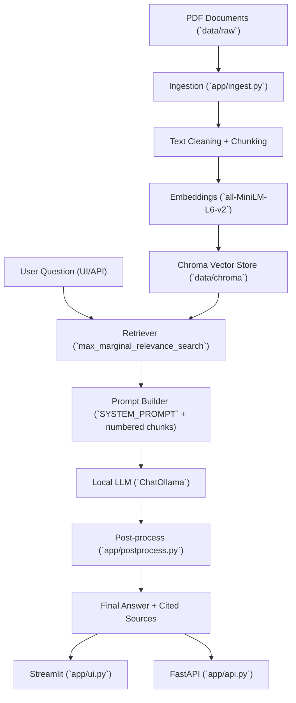

# Architecture

## End-to-End Flow

## Components

- Ingestion: extracts page text from PDFs, normalizes text, assigns metadata (`source_file`, `page_number`), then chunks for indexing.
- Retrieval: uses MMR to balance relevance and diversity across chunks.
- Generation: prompts local Ollama model to answer using only retrieved context.
- Post-processing: enforces answer shape and citation rules, removes low-value source-list outputs, and keeps only cited chunk mappings.
- Evaluation: local deterministic scripts measure citation/format compliance and lexical grounding proxies.

## Design Choices

- Local-first stack (Ollama + Chroma) keeps costs near zero.
- Explicit chunk numbering enables controllable citation references in output.
- Post-generation normalization improves robustness against prompt-format failures.
